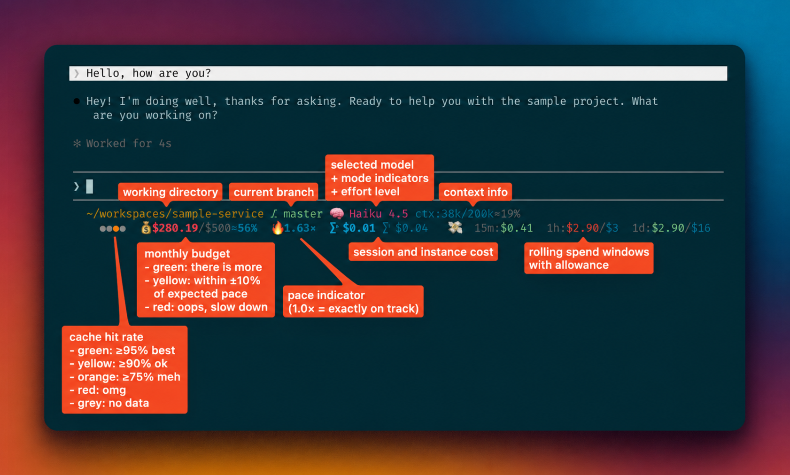
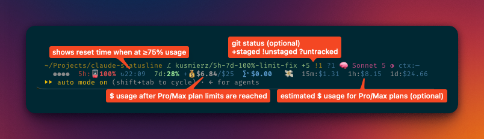

# claude-statusline

Claude Code is powerful, but it can be hard to see what each prompt is costing you. Tokens add up quietly in the background, and you often only notice after a session runs long, a "quick" task turns into a $10 detour, or you've burned through too much of your monthly budget in the first week.

This custom statusline gives you that missing visibility — a compact two-line bar at the bottom of the terminal that turns usage data into a summary you can check at a glance.





## What it shows

**Line 1:** Working directory · git branch · optional git-status markers · thinking indicator · model name · effort/fast-mode glyphs · colored context usage

**Line 2:** Cache/latency dots · plan/budget segment · session cost · rolling 💸 spend windows (15m/1h/1d)

It helps you answer immediately:
- How much context is left before auto-compact kicks in?
- How much is this session costing?
- Which model is active — is it more expensive than needed?
- Are you on track with your monthly budget?
- Is cache reuse healthy, or am I paying rebuild tax?

## Requirements

Pure macOS is missing a few tools. Install them with [Homebrew](https://brew.sh):

```bash
# Install Homebrew if you don't have it
/bin/bash -c "$(curl -fsSL https://raw.githubusercontent.com/Homebrew/install/HEAD/install.sh)"

# Required: JSON processor
brew install jq

# Recommended: bash 4+ (macOS ships 3.2; works but upgrading avoids edge cases)
brew install bash

# Required for budget/💰 display: GNU timeout
brew install coreutils
```

Everything else (`awk`, `curl`, `git`, `security`, `stat`, `date`, `sed`, `tr`, `cut`, `sort`) is included with macOS or Xcode Command Line Tools. If you don't have those yet:

```bash
xcode-select --install
```

For running the test suite, also install [bats-core](https://github.com/bats-core/bats-core):

```bash
brew install bats-core
```

## Installation

### Installation Script

Run the checked-in installer:

```bash
curl -fsSL 'https://raw.githubusercontent.com/apolloio/claude-statusline/main/install.sh' | bash
```

The installer downloads the statusline script from the Apollo-owned repository:

```bash
https://raw.githubusercontent.com/apolloio/claude-statusline/main/statusline-command.sh
```

It creates `~/.claude` when needed, downloads the script, updates `~/.claude/settings.json` safely (existing files are backed up to `settings.json.bak.<timestamp>.<pid>`). If you already have a different `statusLine` command, the installer stops instead of overwriting it.

If you have a customized `statusLine`, merge this block manually into `~/.claude/settings.json`:

```json
"statusLine": {
  "type": "command",
  "command": "bash ~/.claude/statusline-command.sh"
}
```

### Manual Installation

Save the script to `~/.claude/statusline-command.sh`:

```bash
curl -fsSL -o ~/.claude/statusline-command.sh 'https://raw.githubusercontent.com/apolloio/claude-statusline/main/statusline-command.sh'
```

Then wire it into Claude Code. If you have `jq` installed, this one-liner patches your settings automatically:

```bash
jq '.statusLine = {"type":"command","command":"bash ~/.claude/statusline-command.sh"}' ~/.claude/settings.json > /tmp/s.json && mv /tmp/s.json ~/.claude/settings.json
```

Or add it manually to `~/.claude/settings.json` as mentioned above.

## Reading the statusline

### Line 1: Session context

**Working directory and git branch** — orientation at a glance. Both are shortened to fit the terminal width: intermediate path segments shrink to their first letter, the last segment gets middle-ellipsis if needed (`~/P/a/claud(...)sline`). Branch is given priority space; the env vars `CLAUDE_STATUSLINE_CWD_MAXLEN` and `CLAUDE_STATUSLINE_BRANCH_MAXLEN` cap the maximum length.

**Git status markers** (optional) — put a compact working-tree summary beside the branch. Set `CLAUDE_STATUSLINE_GIT_STATUS=dirty` to show changed files, or `on` to also show upstream divergence:

- `+N` green — staged files
- `!N` yellow — unstaged changes
- `?N` dim — untracked files
- `↑N` / `↓N` dim green/orange — commits ahead of or behind the upstream branch (`on` only)

Markers are off by default, so the normal statusline performs no extra `git status` call. Set `CLAUDE_STATUSLINE_GIT_UNTRACKED=off` to hide untracked files (and speed up large repositories).

**Model name** — which Claude model is active. 🧠 prefix when extended thinking is on; `↯` suffix when fast mode is enabled. Model choice is the single biggest lever on cost: Haiku is cheap and fast, Sonnet is balanced, Opus is powerful but expensive. Confirm you're not burning Opus credits on routine tasks.

**Effort level** — how much reasoning work the model does before responding:

| Glyph | Level | Notes |
|-------|-------|-------|
| ○ | low | Minimal reasoning |
| ◑ | medium | Practical ceiling for everyday work |
| ● | high | Deeper reasoning, higher cost |
| ◉ | xhigh | Noticeably more expensive |
| ◈ | max | Save for genuinely hard problems |

Leaving effort on max all the time can easily double or triple your monthly bill without proportional value.

**Ultracode** — when `/effort ultracode` is active, the usual `xhigh` glyph is replaced with a rainbow `ultracode` badge. Claude Code reports Ultracode as plain `xhigh` to statusline commands, so the script detects it from the session transcript. After changing effort, the badge can lag by one prompt; it only appears while the reported effort level remains `xhigh`. Set `CLAUDE_STATUSLINE_ULTRACODE=off` to disable the transcript scan and keep the standard `◉` glyph.

**Context usage** (`ctx:80k/200k [61%]`) — how much of the session context is used. Color signals:

- **Blue** — token count is high (>150k by default), even if % looks fine. LLM attention is still limited regardless of window size.
- **Orange** — getting close; auto-compact will fire soon (at 75% of the effective ceiling by default).
- **Red** — past the auto-compact threshold. You should rarely see this since Claude Code compacts before it gets here.

The context window is the model's working memory. As it fills up, Claude Code auto-compacts by summarizing earlier parts of the session — which preserves the thread but can drop detail. Consider summarizing intentionally or starting fresh with `/clear` before it gets critical.

### Line 2: Cost and performance

**Cache/latency dots** — four colored dots that compress cache health into one badge, based on the session transcript:

| Dots | Meaning |
|------|---------|
| `●○○○` green | High cache reuse, fast responses. Keep going. |
| `○●○○` yellow | Moderate cache or acceptable latency. Fine. |
| `○○●○` orange | Low cache or slow responses. Efficiency dropping. |
| `○○○●` red | Minimal cache, slow responses. Paying rebuild tax. |
| `○○○○` grey | Not enough data yet. Normal at session start. |

Cache reuse means cheaper prompts (cached tokens cost ~10% of fresh input tokens). Stay in one thread per task — switching models or starting a new session clears the cache and forces a full reread.

**Monthly budget** (`💰 $53.77/$500 ≈37% 🔥2.13×`) — used vs. limit, fetched from the Anthropic OAuth API and refreshed every 5 minutes in the background. The `≈X%` is budget consumed; `🔥N×` is pace (1.0× = exactly on track). The badge color compares spend against workday progress:

- **Green** — spend is at or below the pace of the month so far.
- **Yellow** — within ±10% of expected pace.
- **Red** — spending faster than the month is progressing. Slow down.

If it's red on the 10th, you have a problem. If it's green on the 28th, you're fine.

**Session cost** (`∑ˢ $11.56`) — API spend since the last `/clear`. Resets because `/clear` starts a new `session_id`, which the script uses as the baseline reference. The most actionable metric: it answers "was this task cheap, reasonable, or surprisingly expensive?" If a session is already $10+, check whether the model, effort level, or loaded files are efficient.

**Instance cost** (`∑ⁱ $14.20`) — total spend for the entire Claude Code process lifetime, never reset by `/clear`. Shown dimmer, and only when it differs from ∑ˢ by more than $0.01 — before the first `/clear` they're always equal so only ∑ˢ appears. Useful for seeing the full cost of a long working session across multiple conversations.

**Rolling spend windows** (`💸 15m:$0.86 1h:$0.86/$4 1d:$10.17/$25`) — total spend across all Claude sessions in each time window. The dim `/$X` suffix is your per-window allowance: the slice of remaining monthly budget that keeps you on pace for the rest of the month.

Colors are driven by per-window allowances computed from your remaining monthly budget: `remaining_budget ÷ remaining_workdays ÷ hours_per_day`. This is dynamic — it tightens as the month progresses.

- **Green** — within the pro-rated limit.
- **Yellow** — within ±7.5% of the limit.
- **Red** — over by more than 7.5%.

The 15m window is the sharpest signal: if it turns red, something expensive is happening right now (large agentic run, huge context, high effort). The 1d window catches slower cost drift.

**Pro / Max usage** (`5h:82% ↻17:00  7d:7%  +💰$0.00/$1`) — shows short- and long-window utilization, with a local reset time once a window reaches 75%. When a window is exhausted, it remains identifiable as `5h:🪫100%` or `7d:🪫100%` and retains its reset time when available. The compact `+💰$used/$limit` badge previews or reports enabled extra usage; it appears once the 5h window reaches 75% by default, even before extra credits are spent. Use `CLAUDE_STATUSLINE_EXTRA_PREVIEW_PCT` (0–100) to change that threshold.

## Configuration

All options are environment variables. Set them in the `env` block of `~/.claude/settings.json`.

Example configuration:

```json
{
  "env": {
    "CLAUDE_AUTOCOMPACT_PCT_OVERRIDE": "50",
    "CLAUDE_STATUSLINE_SHOW_PACE_RATIO": "off",
    "CLAUDE_STATUSLINE_COST_LOADAVG": "off",
    "CLAUDE_STATUSLINE_COST_CURRENT": "off",
    "CLAUDE_STATUSLINE_PERF_BADGE": "off"
  },
  "statusLine": {
    "type": "command",
    "command": "bash ~/.claude/statusline-command.sh"
  }
}
```

### Feature flags

| Variable | Values | Default | Effect |
|---|---|---|---|
| `CLAUDE_STATUSLINE_COST_CURRENT` | `on` \| `session` \| `instance` \| `off` | `on` | Which cost badges appear. `on`: show ∑ˢ always, ∑ⁱ only when it differs. `session`/`instance`: show one only. `off`: hide both. |
| `CLAUDE_STATUSLINE_COST_LOADAVG` | `on` \| `spent_only` \| `off` | `on` | Rolling 💸 windows. `on` includes allowance suffix; `spent_only` shows spend only; `off` hides the segment entirely. |
| `CLAUDE_STATUSLINE_PERF_BADGE` | `on` \| `cache_only` \| `latency_only` \| `off` | `on` | Cache/latency dot cluster. |
| `CLAUDE_STATUSLINE_ULTRACODE` | `on` \| `off` | `on` | Detect `/effort ultracode` from the session transcript and show the rainbow `ultracode` badge in place of the `xhigh` glyph. |
| `CLAUDE_STATUSLINE_SHOW_PACE_RATIO` | `on` \| `off` | `on` | Show 🔥pace× in the monthly segment. |
| `CLAUDE_STATUSLINE_GIT_STATUS` | `off` \| `dirty` \| `on` | `off` | Branch-adjacent git markers. `dirty` shows `+N`/`!N`/`?N`; `on` also shows `↑N`/`↓N` upstream divergence. |
| `CLAUDE_STATUSLINE_GIT_UNTRACKED` | `on` \| `off` | `on` | Show the `?N` untracked-file marker when git status markers are enabled. |
| `CLAUDE_STATUSLINE_EXTRA_PREVIEW_PCT` | `0`–`100` | `75` | Pro/Max 5h utilization at which to show the extra-usage badge, even with $0 used. |

### Line 1 display lengths

| Variable | Default | Effect |
|---|---------|---|
| `CLAUDE_STATUSLINE_CWD_MAXLEN` | `64`    | Hard ceiling on visible CWD length. Actual length is computed from terminal width; this caps it. |
| `CLAUDE_STATUSLINE_BRANCH_MAXLEN` | `64`    | Hard ceiling on visible git branch length. Branch gets priority when distributing line space. |

### Context window thresholds

| Variable | Default | Effect |
|---|---|---|
| `CLAUDE_AUTOCOMPACT_PCT_OVERRIDE` | unset | Sets the effective ceiling (capped at 95%). Red at or above, orange below. |
| `CLAUDE_STATUSLINE_CTX_WARN_PCT` | `75` | Orange starts at this % of the effective ceiling. |
| `CLAUDE_STATUSLINE_CTX_CAUTION_TOKENS` | `150000` | Blue caution when estimated used tokens exceed this. `0` = disabled. |

### Budget / runway (Enterprise)

| Variable | Default | Effect |
|---|---|---|
| `CLAUDE_STATUSLINE_BUDGET_SIGN_MODE` | `neutral` | `neutral` \| `used_minus` \| `remaining_plus` \| `both` |
| `CLAUDE_STATUSLINE_BUDGET_HOURS_PER_DAY` | `6` | Coding hours per workday for allowance math. |
| `CLAUDE_STATUSLINE_BUDGET_WORK_DAYS` | `12345` | ISO weekday digits that count as workdays (1=Mon, 7=Sun). |
| `CLAUDE_STATUSLINE_BUDGET_HOLIDAYS` | unset | Comma-separated `YYYY-MM-DD` dates excluded from workday count. |

## Plan support

- **Pro / Max** — shows 5h and 7d session usage windows, reset times on high or fully exhausted windows, and the optional compact `+💰$used/$limit` extra-usage badge.
- **Enterprise** — shows a monthly budget segment with workday-pace math and per-window allowances.

## Troubleshooting

**Weird characters or garbled output** — upgrade bash. macOS ships with bash 3.2 (2007); the script works on 3.2, but `brew install bash` is recommended to avoid edge-case quirks.

**No budget/💰 display** — install GNU coreutils: `brew install coreutils`. The script uses `gtimeout` (GNU timeout), which macOS doesn't include.

**`jq: command not found`** — `brew install jq`.

**Only one line visible** — your terminal window is too narrow. The statusline needs at least 86 characters; 90+ is recommended.

**Status line not appearing at all** — verify your `settings.json` has the `statusLine` block with the correct path, and that the script file exists at `~/.claude/statusline-command.sh`.

## How it works

Everything lives in `statusline-command.sh`. On each invocation it:

1. Reads the JSON payload from stdin in a single `jq` pass.
2. Reads/writes persistent cache files under `~/.claude/`:
   - `statusline-global-usage-log.cache` — append-only cost time series for rolling windows
   - `statusline-session-baselines.tsv` — per-session cost baseline (resets on `/clear`)
   - `statusline-instance-carry.cache` — accumulated pre-`/clear` cost so ∑ⁱ reflects the full process lifetime (needed since Claude Code ≥ 2.1.211 resets `cost.total_cost_usd` at `/clear`)
   - `statusline-usage-cache.json` — OAuth API response cached for 300s; refreshed in background
   - `statusline-runway-allowances.cache` — Enterprise per-window budget allowances; invalidated at midnight
3. Assembles and prints two lines to stdout.

## Testing

```bash
bats tests/
```

To test manually:

```bash
cat examples/input.json | bash statusline-command.sh
```

## Reference

- [`SPEC.md`](SPEC.md) — authoritative specification for all behavior, input schema, output format, env vars, and edge cases
- [`CHANGELOG.md`](CHANGELOG.md) — feature history
