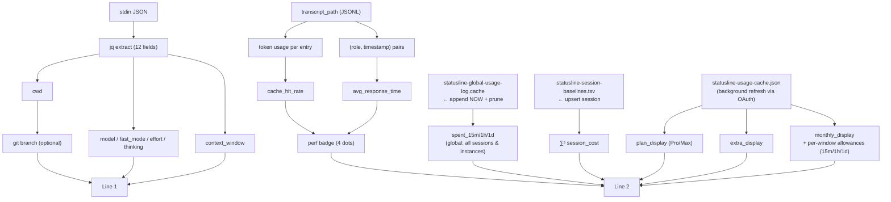

# Claude Code Statusline — Product & Data Specification

> Comprehensive specification for reimplementing `statusline-command.sh` from scratch.

---

## 1. Overview

A single-invocation shell script that reads a JSON payload on **stdin**, reads/writes several persistent cache files, and prints **two lines** of ANSI-colored text to **stdout** for display as a Claude Code statusline.

### Invocation contract

```
<json-payload> | statusline-command.sh
```

Stdout: line 1 (newline-terminated) + line 2 (no trailing newline).  
Stderr: suppressed / ignored by callers.

---

## 2. Input JSON Schema

All fields are optional with defined fallbacks.

| JSON path | Type | Fallback | Notes |
|---|---|---|---|
| `workspace.current_dir` or `cwd` | string | `""` | Working directory |
| `model.display_name` | string | `""` | Human model name, e.g. `"Sonnet 4.6"` |
| `context_window.used_percentage` | number 0–100 | `""` | Percent of context used |
| `context_window.context_window_size` | integer | `""` | Window size in tokens |
| `cost.total_cost_usd` | float | `0` | Cumulative cost for this instance |
| `version` | string | `"2.1.76"` | Claude Code CLI version (sent in OAuth User-Agent) |
| `session_id` | string | `""` | Unique per conversation; new after `/clear` |
| `transcript_path` | string | `""` | Path to JSONL transcript file |
| `fast_mode` | boolean | absent | Orange `↯` indicator when true |
| `effort.level` | string | `""` | One of: `none low medium auto high xhigh max` |
| `thinking.enabled` | boolean | absent | 🧠 prefix before model name |

**CR-stripping:** All extracted strings have `\r` removed before use (CRLF safety).

---

## 3. Environment Variables

All are optional. All string comparisons are case-insensitive.

### 3.0 Path override

| Variable | Type | Default | Effect |
|---|---|---|---|
| `CLAUDE_STATUSLINE_STATE_DIR` | path | `~/.claude` | Base directory for all state/cache files. Overrides the default `$HOME/.claude` for every file listed in §4. |
| `CLAUDE_STATUSLINE_INSTANCE_ID` | string | (unset — auto-derived) | Overrides the auto-derived instance key used for the ∑ⁱ carry cache filename (§4.3). Advanced/testing use: deterministic tests, or wrapper-shell setups where the ppid-walk can't find the owning `claude` process. |

### 3.1 Feature flags

All value strings are case-insensitive; unrecognized values fall back to `on`.

| Variable | Values | Default | Effect |
|---|---|---|---|
| `CLAUDE_STATUSLINE_COST_CURRENT` | `on` \| `session` \| `instance` \| `off` | `on` | Which cost badges appear on line 2 (§8.6). `on`: show ∑ˢ always; show ∑ⁱ only when it differs from ∑ˢ. `session`: ∑ˢ only (cost since last `/clear`). `instance`: ∑ⁱ only (total cost for the current process lifetime). `off`: hide both badges. |
| `CLAUDE_STATUSLINE_COST_LOADAVG` | `on` \| `spent_only` \| `off` | `on` | Rolling 💸 window behavior. `on` shows allowance suffix on 1h/1d; `spent_only` shows spent amounts only; `off` hides the whole 💸 segment and skips its computation. |
| `CLAUDE_STATUSLINE_PERF_BADGE` | `on` \| `cache_only` \| `latency_only` \| `off` | `on` | Performance dots. `cache_only` skips response-time scan; `latency_only` skips cache-token scan; `off` skips all transcript I/O. |
| `CLAUDE_STATUSLINE_ULTRACODE` | `on` \| `off` | `on` | Detect `/effort ultracode` from transcript attachments and render the rainbow `ultracode` badge in place of the `xhigh` glyph (§7.6). `off` skips the extra transcript scan. |
| `CLAUDE_STATUSLINE_SHOW_PACE_RATIO` | `on` \| `off` | `on` | Show 🔥pace× in Enterprise monthly segment |
| `CLAUDE_STATUSLINE_GIT_STATUS` | `off` \| `dirty` \| `on` | `off` | Git status markers on the line 1 branch segment (§7.3.1). `off`: no markers, no extra `git status` call. `dirty`: `+N`/`!N`/`?N` count markers only. `on`: markers plus `↑N`/`↓N` upstream divergence. |
| `CLAUDE_STATUSLINE_GIT_UNTRACKED` | `on` \| `off` | `on` | Whether untracked files render the `?N` marker (§7.3.1). Only consulted when `CLAUDE_STATUSLINE_GIT_STATUS != off`. `off` also passes `--untracked-files=no` to `git status`, which is faster in repos with large untracked/ignored trees. |

### 3.2 Context window thresholds

| Variable | Type | Default | Effect |
|---|---|---|---|
| `CLAUDE_AUTOCOMPACT_PCT_OVERRIDE` | integer 1–100 | unset | Sets effective ceiling `E = min(value, 95)`. Red at `used% ≥ E`, orange between `E × warn_pct%` and `E`. |
| `CLAUDE_STATUSLINE_CTX_WARN_PCT` | integer 1–99 | `75` | Always active. Share of effective ceiling `E` at which orange starts. When `CLAUDE_AUTOCOMPACT_PCT_OVERRIDE` is unset, `E` defaults to `95`. |
| `CLAUDE_STATUSLINE_CTX_CAUTION_TOKENS` | integer | `150000` | Blue caution color when estimated used tokens exceed this. `0` = disabled. |

**Default thresholds (no override):** `E = 95`, `warn_at = 95 × 75% = 71.25` → orange when `used% > 71`, red when `used% ≥ 95`.

### 3.3 Budget / runway (Enterprise)

| Variable | Type | Default | Effect |
|---|---|---|---|
| `CLAUDE_STATUSLINE_BUDGET_SIGN_MODE` | `neutral` \| `used_minus` \| `remaining_plus` \| `both` | `neutral` | How dollar amounts are signed (see §8.5) |
| `CLAUDE_STATUSLINE_BUDGET_HOURS_PER_DAY` | float > 0 | `6` | Coding hours per workday for runway math |
| `CLAUDE_STATUSLINE_BUDGET_WORK_DAYS` | string of digits 1–7 | `"12345"` | ISO weekdays that count as workdays (1=Mon, 7=Sun). Deduped, sorted Mon→Sun. Min 1 day. |
| `CLAUDE_STATUSLINE_BUDGET_HOLIDAYS` | comma-separated `YYYY-MM-DD` | unset | Public holidays. Only counted if they fall on a configured workday. |

### 3.4 Line 1 display lengths

| Variable | Type | Default | Effect |
|---|---|---------|---|
| `CLAUDE_STATUSLINE_CWD_MAXLEN` | integer ≥ 8 | `64`    | Hard ceiling on visible CWD length (chars). Actual length may be less based on terminal width. Invalid values (non-integer or < 8) fall back to `64`. |
| `CLAUDE_STATUSLINE_BRANCH_MAXLEN` | integer ≥ 8 | `64`    | Hard ceiling on visible git branch length (chars). Invalid values fall back to `32`. |

### 3.5 Extra-credits preview (Pro/Max)

| Variable | Type | Default | Effect |
|---|---|---|---|
| `CLAUDE_STATUSLINE_EXTRA_PREVIEW_PCT` | integer 0–100 | `75` | Threshold for `five_hour.utilization` (in %) above which the Pro/Max extra-credits badge appears even when `used_credits == 0`. `0` = always show the extra badge whenever `extra_usage.is_enabled` and `monthly_limit > 0`. Rationale: gives users a heads-up of their pay-as-you-go balance during the final ~quarter of the 5h window, before they spill into extra credits. |

---

## 4. Persistent State Files

All files live under `~/.claude/` by default. Set `CLAUDE_STATUSLINE_STATE_DIR` to redirect all state files to a different directory (useful for testing or multi-profile setups).

### 4.1 Global usage log
**Path:** `~/.claude/statusline-global-usage-log.cache`  
**Format:** one row per line: `<epoch_seconds> <session_id> <cost_usd> <workspace_hash>`  
- `workspace_hash` = SHA-256 of `cwd` (fallback: `cksum` digest; fallback: `"empty"`).  
**Purpose:** Time series for rolling 💸 spend windows (15m, 1h, 1d).  
**Write:** appended unconditionally on every invocation with `NOW session_id cost workspace_hash`.  
**Prune:** size-gated — run only when `file_size > LOG_PRUNE_SIZE_MAX` (≈256 KB). When triggered, keep:
- All rows within the last 36 h.
- One anchor per `session_id`: the single most-recent row older than 36 h for each unique `session_id`. Anchors let the window algorithm detect spend that started before the 36 h horizon without bloating the file.
- Result sorted by epoch ascending.

**Atomicity:** the prune writes to a per-process temp file (`$LOG_FILE.$$.$RANDOM.tmp`), verifies it is non-empty (`[ -s ]`), then atomic-renames it into place. This prevents concurrent prune writers from interleaving writes into a truncated/garbled file. The EXIT trap removes any leftover temp files on abort.

**Locking:** serialize with mkdir-based lock (see §9).  
**Row filtering in `calc_spent_all`:** only rows with `NF < 4` are skipped. All remaining rows are eligible regardless of `workspace_hash` — rolling windows reflect **global** spend across all workspaces, sessions, and instances.

### 4.2 Session baselines
**Path:** `~/.claude/statusline-session-baselines.tsv`  
**Format:** TSV, 4 columns: `session_id  baseline_cost  first_seen_epoch  last_used_epoch`  
**Purpose:** ∑ˢ (cost since last `/clear`) — baseline is the `cost` at first sight of a session_id. Also **consumed** by the 💸 1d rolling-window math as a lower bound on the daily reference (see §8.7).  
**Write:** updated on every invocation (upsert by session_id, update `last_used_epoch`). Rewrites use the same per-process temp file + non-empty guard + atomic-rename pattern as the global log (see §4.1).  
**GC:** ~1% of runs (`RANDOM % 100 == 0`) remove rows idle > 30 days.  
**Locking:** same lock as global usage log (written in same atomic block).

### 4.3 Instance carry cache
**Path:** `~/.claude/statusline-instance-carry.<instance_key>.cache`  
**Format:** 3 lines: `session_id`, `last_cost` (float), `carry` (float).  
**Purpose:** ∑ⁱ (total cost across all `/clear` resets in this process) — Claude Code resets `cost.total_cost_usd` to 0 at each `/clear` while generating a new `session_id`, so this file carries the pre-/clear accumulated cost forward.  
**Write:** every invocation (overwrite, no lock — single-line write, last-writer-wins is acceptable).  
**Detection:** session change (`session_id` differs from stored) OR cost decrease (`cost < last_cost - 0.001`) triggers accumulation: `carry += last_cost`. Otherwise `carry` is unchanged and `last_cost` is updated to current cost.  
**Instance cost formula:** `instance_cost = carry + session_cost`.

**Instance key (`_instance_key()`):** the cache file is keyed to the owning `claude` process so a freshly opened instance never inherits another instance's accumulated carry. Derivation:
- If `CLAUDE_STATUSLINE_INSTANCE_ID` is set, it is used verbatim as the key (advanced/testing override).
- Otherwise, walk the `ppid` chain from `$$` (max 4 hops, same idiom as `_term_width_from_ancestor_pty()` in §11). At each hop, the ancestor's `comm` basename is checked; the first ancestor named `claude` supplies the key `<pid>-<lstart digits>` (the process start time, digits only, guards against a recycled pid reattaching to a dead instance's carry — the original bug).
- **Fallbacks**, in order: if no ancestor named `claude` is found within 4 hops, the hop-1 parent's `<pid>-<lstart digits>` is used (covers wrapper-shell statusline configs); if `ps` yields nothing at all, the literal key `shared` is used.
- **Stale-file reap:** on an instance's first render (i.e. when its keyed `CARRY_FILE` does not yet exist), two cleanup actions run once: `find ~/.claude -maxdepth 1 -name 'statusline-instance-carry.*.cache' -mtime +1 -delete` removes carry files from instances that exited more than a day ago, and the pre-fix single global file `~/.claude/statusline-instance-carry.cache` is removed if present (clears stale carry left over from before per-instance keying).

### 4.3 OAuth usage cache
**Path:** `~/.claude/statusline-usage-cache.json`  
**Format:** JSON response from `GET https://api.anthropic.com/api/oauth/usage`  
**Purpose:** Pro/Max plan utilization + Enterprise extra_usage budget.  
**TTL:** `CACHE_TTL = 300 s`. Refresh triggered in background when `cache_age ≥ CACHE_TTL`.  
**Stale threshold:** `cache_age ≥ 3 × CACHE_TTL` (≥15 min). Whether stale styling (⚠️, STRIKETHROUGH) is shown depends on the lock-age window — see §4.4.

### 4.4 OAuth fetch lock
**Path:** `~/.claude/statusline-usage-fetch.lock`  
**Format:** plain text (content ignored; only mtime is read)  
**Purpose:** rate-limits OAuth refreshes and drives stale-display decisions via three lock-age windows.

**Constants:**

| Constant | Value | Meaning |
|---|---|---|
| `LOCK_INFLIGHT_GRACE` | 60 s | Lock age below this → fetch still in flight → suppress ⚠️ |
| `FETCH_RETRY_COOLDOWN` | 120 s | Don't spawn a new fetch more often than this |
| `LOCK_LEAK_TIMEOUT` | 600 s | Lock older than this → abandoned (sleep/reboot) → delete, treat as hopeful |

**Lifecycle (four phases, in order):**
1. **Phase 1 — read lock state** (no mutations): record `_lock_age` from the lock file mtime.
2. **Phase 2 — stale display decision** (before fetch spawn so a brand-new lock doesn't suppress ⚠️ on the same render):
   - If `cache_age ≥ 3 × CACHE_TTL` and lock file exists:
     - `_lock_age < LOCK_INFLIGHT_GRACE` → fetch in flight → ⚠️ suppressed.
     - `LOCK_INFLIGHT_GRACE ≤ _lock_age < LOCK_LEAK_TIMEOUT` → fetch completed without refreshing → ⚠️ shown.
     - `_lock_age ≥ LOCK_LEAK_TIMEOUT` → lock abandoned → ⚠️ suppressed (hopeful).
   - If lock file does not exist (first render after expiry): ⚠️ suppressed (hopeful, fetch spawned next).
3. **Phase 3 — clean up leaked lock**: if `_lock_age ≥ LOCK_LEAK_TIMEOUT`, delete the lock file.
4. **Phase 4 — fetch trigger** (rate-limited): if `cache_age ≥ CACHE_TTL` and either no lock file exists or `_lock_age ≥ FETCH_RETRY_COOLDOWN`, touch the lock file and spawn the background fetch. The lock is **not removed on fetch exit** — its mtime serves as the "last fetch attempt" timestamp for future renders.

**Slow-fetch indicator:** if `cache_age ≥ CACHE_TTL + 30` (i.e. the cache is stale and hasn't refreshed within 30 s of expiry), set the slow-fetch flag → dim `↻` shown on line 2 *before* the plan/extra/monthly segment (§10 item 4).

### 4.5 Runway allowance cache
**Path:** `~/.claude/statusline-runway-allowances.cache`  
**Format:** single space-separated line: `epoch ymd monthly_limit_cents hols_cache_key used_credits allowance_15m allowance_1h allowance_1d` (8 fields)  
- `used_credits` = `extra_usage.used_credits` at the time the allowances were computed (cents integer).  
- *Allowance* = the per-window slice of remaining monthly budget that, if spent in every window, would consume the budget over the remaining workdays. Calculated once at local midnight (or first invocation of the day) and cached for the whole day so the displayed number does not drift as spend accrues.  
**Purpose:** avoids recomputing Enterprise per-window allowances on every invocation.  
**Invalidation:** recompute when any of these change: local calendar date (YMD), stored epoch before local midnight (`epoch < local_day_start`), `monthly_limit`, or holidays key (`total:remaining:elapsed`). `used_credits` deliberately does **not** invalidate a same-day cache row — the allowance is meant to hold steady for the whole day even as spend accrues (see §4.4 test coverage).
**Write gate:** a new row is only written when the OAuth usage cache (`statusline-usage-cache.json`) is actually fresh (`cache_age < 3×CACHE_TTL`, §4.4), independent of the display-only ⚠️/"hopeful" staleness flag. Without this, the first render of a day with a merely-old (but not yet flagged-stale) cache — e.g. after the machine slept across a monthly `used_credits` reset — would pin that stale snapshot's `used_credits` into the day's allowance for the full 24h, producing a wrong per-window budget until the next calendar day.

### 4.6 OAuth auth-error sentinel
**Path:** `~/.claude/statusline-usage-fetch.error`  
**Format:** single line containing the epoch seconds of the failure.  
**Purpose:** distinguishes "fetch failed — likely auth problem" from "cache merely stale."  
**Write:** the background OAuth fetch creates this file when either (a) keychain returned an empty token, (b) `curl` exited non-zero or the response was not parseable JSON, or (c) the response was valid JSON but contained a top-level `"error"` key (e.g. a rate-limit or server error from the API). In case (c) the existing cache file is preserved rather than replaced.  
**Clear:** removed by the next successful fetch (before the response is atomically moved into the usage cache).  
**Effect on display:** while this file exists, the Pro/Max extra badge and the Enterprise monthly segment switch to the **auth-broken state** (🔑 glyph + strikethrough on the last-known amount); see §8.3 and §8.4.

---

## 5. External Calls

### 5.1 OAuth token retrieval (macOS Keychain)
```
security find-generic-password -s "Claude Code-credentials" -w
  | jq -r '.claudeAiOauth.accessToken // empty'
```
Wrapped with `timeout 5` when available.

### 5.2 Usage API fetch
```
GET https://api.anthropic.com/api/oauth/usage
Authorization: Bearer <token>
anthropic-beta: oauth-2025-04-20
User-Agent: claude-code/<version>
```
The payload-provided version is restricted to ASCII letters, digits, `.`, `_`,
`+`, and `-`, then capped at 64 characters before header interpolation. If no
characters remain, the default version `2.1.76` is used.

Max timeout: 10 s via `curl --max-time 10`. Response written to `.tmp` then atomically moved.

---

## 6. ANSI Color Constants

| Name | Escape | Appearance |
|---|---|---|
| `DIM` | `\033[90m` | Dark grey |
| `GREEN` | `\033[32m` | Green |
| `YELLOW` | `\033[33m` | Yellow |
| `ORANGE` | `\033[38;5;208m` | 256-color orange |
| `RED` | `\033[31m` | Red |
| `BLUE` | `\033[34m` | Blue |
| `MAGENTA` | `\033[35m` | Magenta |
| `BOLD` | `\033[1m` | Bold |
| `STRIKETHROUGH` | `\033[9m` | Strikethrough |
| `RESET` | `\033[0m` | Reset all |

**Special characters:**
- `SPACE` = U+200B (zero-width space, UTF-8 `\xe2\x80\x8b`) — leads line 2
- `BRANCH_ICON` = `⎇` (U+2387, 1-column-wide)

**Glyph cheatsheet (used elsewhere in the spec):**

| Glyph | Meaning |
|---|---|
| `💰` | Fresh usage/budget value |
| `⚠️` | Stale cache (last value still shown, no fetch error) |
| `🔑` | Auth-broken (last OAuth fetch failed or token retrieval returned empty) |
| `🪫` | Budget burned (utilization ≥ 100%) |
| `🔥` | Pace ratio (`usage_pct / day_pct`) in the Enterprise monthly segment |
| `💸` | Rolling spend windows segment leader |
| `🧠` | Extended-thinking indicator |
| `↯` | Fast-mode indicator |
| `↻` | Refresh-in-progress / slow-fetch indicator |

Performance badge dot colors (256-color):
- Active green: `\033[38;5;82m`
- Active yellow: `\033[38;5;220m`
- Active orange: `\033[38;5;208m`
- Active red: `\033[38;5;196m`
- Inactive grey: `\033[38;5;245m`

---

## 7. Line 1 — Session Status

### 7.1 Assembled format
```
RESET YELLOW<cwd>RESET [GREEN⎇ <branch>RESET[git_status_markers]] [🧠] [MAGENTA<model>RESET][model_flags][ctx_display]
```

### 7.2 CWD segment (yellow)
- Value: `workspace.current_dir` or `cwd` from input JSON.
- Transform: replace leading `$HOME` with `~`.
- **Shortening:** the visible length is capped at `min(dynamic_cwd_budget, CLAUDE_STATUSLINE_CWD_MAXLEN)` using `_shorten_path` (see §7.2.1).

### 7.2.1 Path shortening algorithm (`_shorten_path`)

Applies to both CWD (§7.2) and git branch (§7.3). Given a string `str` and a `max` budget:

1. If `len(str) ≤ max`: return unchanged.
2. **Min-savings guard:** if `len(str) − max < 5`, return `str` unchanged (savings too small to justify ellipsis).
3. Split on `/`. If only one segment: apply `_mid_ellipsis(str, max)`.
4. Reduce all leading segments to two characters: if index 0 is non-empty and not `~` (i.e., a meaningful branch prefix such as `feature` or `sample-user`), abbreviate it to two characters; otherwise keep it verbatim (empty string for absolute paths, `~` for home-relative paths). Reduce every intermediate segment (index 1 .. n-2) to its first two characters. Preserve the last segment (index n-1) intact. If the candidate fits: return it.
5. Compute remaining budget for the last segment: `last_budget = max − prefix_len − 1`.
6. **Prefix-collapse fallback:** if `last_budget ≥ 3` AND `len(last) ≤ max − 1` AND `n ≤ 4` AND `(last_budget − 1) × 2 < len(last)` (mid-ellipsis would retain less than half the last segment): return `"…/" + last`. This may exceed `max` by at most 1 character; the result is still cleaner than a heavily mangled last segment. (Primarily activates for home-relative paths where the leading `~` cannot be abbreviated.)
7. If `last_budget ≥ 3`: apply `_mid_ellipsis` to the last segment only, using `last_budget` as the target.
8. If `last_budget < 3` and `n ≥ 4`: collapse all middle intermediates (indices 2 .. n-3) into a literal `…` token, keeping the first and second-to-last intermediates as two-character abbreviations. Recompute budget for last segment; ellipsize if budget ≥ 3.
9. Final fallback: `_mid_ellipsis(str, max)` on the whole string.

**`_mid_ellipsis(str, target)`:** tail-weighted 40/60 split. `budget = target − 1` (for `…`). `head = max(1, floor(budget × 0.4))`, `tail = budget − head`. Returns `str[0:head] + "…" + str[-tail:]`. Returns `str[0:target]` when `target < 3` (degenerate).

### 7.2.2 Line 1 display budgets

Terminal width is detected in order: (1) `$COLUMNS` env var — set by Claude Code ≥ 2.1.153 when spawning the statusline subprocess, and also honored as a manual override; (2) `/dev/tty` (fails in Claude Code — no controlling tty); (3) stderr-fd tty check (fails in Claude Code); (4) ancestor PTY walk — fallback for Claude Code < 2.1.153: walks `ppid` chain up to 8 hops, queries each ancestor's PTY via `stty -f /dev/$tty size` (macOS) or `stty -F /dev/$tty size` (Linux); (5) fallback 220 (wide, to avoid false compression). A floor of 88 is applied to the result. Fixed overhead is estimated from other line 1 elements (model name length, glyphs present). The combined free budget is `TERM_W − fixed_overhead` (floor at 20).

Branch gets priority: `branch_budget = min(combined × 55%, CLAUDE_STATUSLINE_BRANCH_MAXLEN)`. Branch is resolved first so its actual display length drives the CWD budget: `cwd_budget = min(combined − len(branch_disp) − 3 − git_status_suffix_width, CLAUDE_STATUSLINE_CWD_MAXLEN)` (floor at 8 each). `git_status_suffix_width` is the visible column width of the optional §7.3.1 marker suffix (0 when `CLAUDE_STATUSLINE_GIT_STATUS=off` or no branch is shown); it is accumulated arithmetically while the suffix is built (not measured with `_visible_len`, which is defined later in the script than line 1 assembly) so the subtraction stays exact and locale-independent even though `↑`/`↓` are multibyte.

### 7.3 Git branch segment (green, optional)
- Shown only when `cwd` is non-empty and is inside a git repo.
- Detection: `git -C "$cwd" --no-optional-locks rev-parse --git-dir`
- Branch: `git symbolic-ref --short HEAD`, fallback to `git rev-parse --short HEAD` (detached).
- **Shortening:** the visible length is capped at `min(dynamic_branch_budget, CLAUDE_STATUSLINE_BRANCH_MAXLEN)` using `_shorten_path` (see §7.2.1). Slash-segmented branch names are treated like paths.
- Format: ` GREEN⎇ <branch>RESET[git_status_markers]`

### 7.3.1 Git status markers (optional, `CLAUDE_STATUSLINE_GIT_STATUS`)

Off by default — no extra `git` call is made unless enabled. When `CLAUDE_STATUSLINE_GIT_STATUS != off` and a branch is shown, one additional call collects working-tree state:

```
git -C "$cwd" --no-optional-locks status --porcelain=v1 --branch <--untracked-files=normal|no> 2>/dev/null
```

`--untracked-files=no` is passed when `CLAUDE_STATUSLINE_GIT_UNTRACKED=off`; otherwise `--untracked-files=normal`. The porcelain output is parsed with a single `awk` pass (never a bash `while read` loop) into five fields: `staged` (count of lines whose index column, position 1, is non-space and non-`?`), `unstaged` (count of lines whose worktree column, position 2, is non-space and non-`?`), `untracked` (count of `?? ` lines), `ahead`, `behind` (parsed from the `## branch...upstream [ahead N, behind N]` header). A file with changes in both columns (e.g. staged-then-further-modified) counts toward both `staged` and `unstaged`. A failed or empty `git status` degrades silently to the plain branch segment — no markers, no error.

Markers are appended immediately after the branch segment's `RESET`, **outside** `_shorten_path` — truncating a long branch never eats the status markers. A single leading space separates the branch name from the marker suffix whenever any marker is shown. Order: `+N` (`GREEN`), then a space, `!N` (`YELLOW`), then a space, `?N` (`DIM`, `\033[90m`) — each present only if its count is non-zero, each with its own `RESET` — then a space, `↑N` (`DIM_GREEN`, `\033[2;32m`), then `↓N` (`DIM_ORANGE`, `\033[2;38;5;208m`), each with its own `RESET`. Any marker whose condition is false is omitted entirely, including its separating space.

| Marker | Meaning | Color | Shown when |
|---|---|---|---|
| `+N` | N files with staged changes | `GREEN` | `staged > 0`, any `GIT_STATUS` mode |
| `!N` | N files with unstaged/worktree changes | `YELLOW` | `unstaged > 0`, any `GIT_STATUS` mode |
| `?N` | N untracked files | `DIM` (`\033[90m`) | `untracked > 0` AND `CLAUDE_STATUSLINE_GIT_UNTRACKED != off`, any `GIT_STATUS` mode |
| `↑N` | N commits ahead of upstream | `DIM_GREEN` (dim/faint green) | `ahead > 0` AND `CLAUDE_STATUSLINE_GIT_STATUS=on` |
| `↓N` | N commits behind upstream | `DIM_ORANGE` (dim/faint orange) | `behind > 0` AND `CLAUDE_STATUSLINE_GIT_STATUS=on` |

`CLAUDE_STATUSLINE_GIT_STATUS=dirty` never computes or shows `↑N`/`↓N`, even when the branch has upstream divergence — only `on` does. Detached HEAD still shows `+N`/`!N`/`?N` (no upstream tracking ref, so no arrows regardless of mode).

### 7.4 Thinking indicator (optional)
- Shown when `thinking.enabled == "true"`.
- Prefix before model name: ` 🧠`

### 7.5 Model segment (magenta, optional)
- Shown when `model.display_name` is non-empty.
- Format: ` MAGENTA<name>RESET`
- Followed immediately by `model_flags`.

### 7.6 Model flags (appended to model segment)

| Condition | Glyph | Color |
|---|---|---|
| `fast_mode == "true"` | `↯` | ORANGE |
| `effort_level == "none"` | `∅` | DIM |
| `effort_level == "low"` | `○` | GREEN |
| `effort_level == "medium"` | `◑` | MAGENTA |
| `effort_level == "auto"` | `🅐` | MAGENTA |
| `effort_level == "high"` | `●` | ORANGE |
| `effort_level == "xhigh"` | `◉` | ORANGE |
| `effort_level == "max"` | `◈` | RED |

Each flag prefixed with a space. Unknown `effort_level` → no glyph.

#### Ultracode override

`/effort ultracode` never arrives as its own value: Claude Code normalizes it internally
(`{ultracode: "xhigh"}`), so `effort.level` is delivered as plain `"xhigh"` and there is no
`ultracode` field in the payload. The only observable signal is the pair of transcript
attachment records `ultra_effort_enter` / `ultra_effort_exit` (siblings of `plan_mode` /
`plan_mode_exit`), matched in `transcript_path` as a last-event-wins state machine.

When ultracode is detected, the `xhigh` glyph `◉` is replaced by the word `ultracode`
rendered as a per-letter 256-color rainbow gradient (`196 208 220 190 82 51 33 99 201`),
9 visible columns, still prefixed with a single space.

Preconditions (all must hold):

| Condition | Rationale |
|---|---|
| `CLAUDE_STATUSLINE_ULTRACODE != off` | User escape hatch |
| `effort_level == "xhigh"` | Ultracode implies xhigh; any other level rules it out |
| `transcript_path` exists and is readable | Signal source |
| last matching attachment is `ultra_effort_enter` | Enter/exit state machine |

Gating on `xhigh` also means no transcript scan happens for any other effort level.

**Known limitations:** attachments are only written when the next user prompt is built, so a
freshly toggled level is reflected one prompt late; and a message quoting the literal
attachment-type text is a false positive.

### 7.7 Context window segment

**Computed values:**
- `used_int` = integer part of `used_percentage`
- `W` = `context_window_size` (fallback `200000` if empty/zero)
- `used_tokens` = `round(W × used_int / 100)`
- `used_k` = `fmt_ctx_k(used_tokens)` — if ≥1000 prints `Nk`, else prints `N`
- `win_k` = `fmt_ctx_k(W)`

**Body:** ` ctx:<used_k>/<win_k> [<used_int>%]`

**Color selection (unified):**
```
E = min(CLAUDE_AUTOCOMPACT_PCT_OVERRIDE, 95)   [default: 95 when unset]
warn_at = E × CLAUDE_STATUSLINE_CTX_WARN_PCT / 100   (default warn_pct=75)
if used_int >= E         → RED
elif used_int > warn_at  → ORANGE
elif used_tokens > caution_tokens → BLUE
else                     → DIM
```

**Missing used%:** display ` DIMctx:—RESET`

---

## 8. Line 2 — Cost & Performance

Line 2 **starts** with `SPACE` (U+200B) + `"  "` (two spaces).

### 8.1 Performance badge (optional)

Shown when `CLAUDE_STATUSLINE_PERF_BADGE != "off"` and `transcript_path` is readable.

#### 8.1.1 Cache hit rate (skipped when mode = `latency_only`)
From transcript JSONL, sum across all entries:
- `input_tokens` (from `.message.usage` or `.toolUseResult.usage`)
- `cache_creation_input_tokens`
- `cache_read_input_tokens`

```
total_input = input + cache_creation + cache_read
cache_hit_rate = cache_read / total_input   (float 0–1, or empty if total_input == 0)
```

#### 8.1.2 Average response time (skipped when mode = `cache_only`)
From transcript JSONL, extract `(role, epoch_seconds)` pairs:

Role extraction (in priority order):
1. `.type` == `"user"` or `"human"` → role=user
2. `.type` == `"assistant"` → role=assistant
3. `.message.role` or `.role` == `"human"` or `"user"` → role=user
4. `.message.role` or `.role` == `"assistant"` → role=assistant
5. Otherwise: skip entry

Timestamp normalization (field: `.timestamp`):
- Skip if null or boolean
- Number: if > 9,999,999,999 divide by 1000 repeatedly until ≤ 9,999,999,999
- ISO string: strip fractional seconds (`.NNN` before `Z` or `±HH:MM`), normalize `+00:00`/`-00:00` → `Z`, then `fromdateiso8601`; fallback: try parse as number
- Object: check `.unix`, `.seconds`, `.sec`, `.time` as number/string; fallback `.milliseconds`, `.ms`

Sort pairs by epoch ascending. For each consecutive (user_ts, assistant_ts) pair:
```
d = assistant_ts - user_ts
if d > 0 and d < 86400: include in sum
```
`avg_response_time` = `sum / count` (seconds, 2 decimal places), or empty if count=0 or no role events found.

#### 8.1.3 Badge assembly

Signal levels (0=best, 3=worst):

**Cache level** (direction: higher is better, thresholds in %):
```
cache_percent = cache_hit_rate × 100
level 0 (green):  cache_percent >= 95
level 1 (yellow): cache_percent >= 90
level 2 (orange): cache_percent >= 75
level 3 (red):    otherwise
unknown: cache_hit_rate is empty
```

**Response level** (direction: lower is better, thresholds in seconds):
```
level 0 (green):  avg_response_time <= 10
level 1 (yellow): avg_response_time <= 30
level 2 (orange): avg_response_time <= 60
level 3 (red):    otherwise
unknown: avg_response_time is empty
```

**Overall level:**
- Both unknown → -1 (all grey)
- One unknown → use the other
- Both known → max(cache_level, response_level)

**Badge rendering:** 4 dots, positions 0–3.
- Active dot at position = overall_level
- All grey when overall_level = -1
- Characters: active=`●`, inactive=`○` (emoji mode) or `*`/`o` (no-emoji mode)
- Colored mode (default): active dot uses 256-color per level; inactive dots use grey 245
- Badge followed by `RESET`

### 8.2 Plan display — Pro/Max (optional)

Shown when `five_hour.utilization` is present in usage cache.

Format:
```
<fh_color>5h:[BOLD]<fh_int>%RESET[<fh_sfx>]  <sd_color>7d:[BOLD]<sd_int>%RESET[<sd_sfx>]
```

- `_fh_int` = integer part of `five_hour.utilization`
- `_sd_int` = integer part of `seven_day.utilization`
- Color from `_level_color(int, yt=75, rt=90)`: green < 75%, yellow 75–89%, red ≥ 90%
- BOLD applied when cache is **fresh**; stale state omits BOLD but keeps color and applies STRIKETHROUGH
- `_fh_sfx` / `_sd_sfx`: when utilization ≥ 75% and reset time available, append ` DIM↻HH:MMRESET`
  - Reset time: convert `resets_at` (UTC ISO 8601) → local `HH:MM`

**5h-burned state** (`five_hour.utilization ≥ 100`): replace the 5h slot with `RED BOLD 🪫100%RESET`. The 7d slot keeps its normal rules. If the 7d slot also reaches 100%, apply the same 🪫 treatment to it.

### 8.3 Extra usage badge — Pro/Max (optional)

Shown when: `extra_usage.is_enabled == "true"` AND `monthly_limit != 0` AND (`used_credits > 0` OR `five_hour.utilization ≥ CLAUDE_STATUSLINE_EXTRA_PREVIEW_PCT`).  
The second condition is the *preview*: it surfaces the user's extra-credit balance as their 5h window approaches its cap, so they see what they're about to spill into. Default threshold 75% (see §3.4).

**State selection:**

| State | Trigger | Format |
|---|---|---|
| Fresh | Auth OK, cache age < 2×TTL | `DIM+💰RESET BOLD$<used_fmt>RESET DIM/<limit_fmt>RESET` |
| Stale | Auth OK, cache age ≥ 2×TTL, no fetch in flight | `DIM+⚠️RESET STRIKETHROUGH$<used_fmt>RESET DIM/<limit_fmt>RESET` (no BOLD; STRIKETHROUGH on amount) |
| Auth-broken | Auth-error sentinel (§4.6) present | `DIM+🔑RESET STRIKETHROUGH$<used_fmt>/<limit_fmt>RESET` (no color, amount+limit struck together) |

Auth-broken takes precedence over stale. If the cache has never been populated (no last-known value), the entire extra badge is omitted.

**Formatting:**
- `used_fmt` = `printf "%.2f" (used_credits / 100)` — `used_credits` is stored in cents
- `limit_fmt` = `printf "$%.0f" (monthly_limit / 100)` — `monthly_limit` is stored in cents

### 8.4 Monthly display — Enterprise (optional)

Shown when `five_hour.utilization` is **absent** but `extra_usage.is_enabled == "true"`.

#### 8.4.1 Workday counting
Three integers computed via `count_month_workdays()`:
- `elapsed` — workdays from 1st through today (inclusive)
- `total` — all workdays in the month
- `remaining` — workdays from today through month-end (inclusive; min 1)

Today is in both `elapsed` and `remaining`.

Holiday adjustment (applied after workday counts):
```
_wk_elapsed  -= hols_elapsed_month + hols_today
_wk_total    -= hols_total_month
_wkdays      -= hols_remaining
```
All clamped: elapsed ≥ 0, total ≥ 1, remaining ≥ 1.

**Holiday classification:**
- Only holidays in current calendar month, falling on a configured workday, count.
- `hols_elapsed_month` = holidays in [1st, yesterday] on a workday.
- `hols_remaining` = holidays in [today, EOM] on a workday.
- `hols_today` = 1 if today is a listed holiday on a workday.
- Cache key: `"total:remaining:elapsed"`.

#### 8.4.2 Fractional elapsed workdays (for pace)
```
_today_frac = step / 3   where step = seconds_since_midnight / (6 × 3600), capped at 3
if today is an effective workday and elapsed >= 1:
  wk_elapsed_frac = (elapsed - 1) + today_frac
else:
  wk_elapsed_frac = elapsed
```

#### 8.4.3 Monthly metrics (all in awk)
```
used = ex_used / 100          (USD)
lim  = ex_limit / 100         (USD)
rem  = max(lim - used, 0)
day_pct = wk_elapsed_frac / wk_total
usage_pct = used / lim
pct_int = round(usage_pct × 100)
```

**Pace string:** `sprintf("%.2f", usage_pct / day_pct)` or `"—"` if `day_pct < 1e-9`.

**Pace color (m_color):**
```
if day_pct < 0.05:
  GREEN  if usage_pct < 0.05
  YELLOW if usage_pct <= 0.10
  RED    otherwise
else:
  ratio = usage_pct / day_pct
  GREEN  if ratio < 0.9
  YELLOW if ratio <= 1.1
  RED    otherwise
```

#### 8.4.4 Format

Monthly money string depends on `CLAUDE_STATUSLINE_BUDGET_SIGN_MODE`:
| Mode | Stale | Format |
|---|---|---|
| `neutral` | no | `BOLD m_ansi $<used>RESET` |
| `neutral` | yes | `m_ansi $<used>RESET` (color kept, BOLD removed) |
| `used_minus` | no | `BOLD m_ansi -$<used>RESET` (or `$<used>` if used=0) |
| `remaining_plus` | no | `BOLD m_ansi +$<rem>RESET` |
| `both` | no | `BOLD m_ansi -$<used> +$<rem>RESET` |

**State glyph:**

| State | Trigger | Glyph | Amount styling |
|---|---|---|---|
| Fresh | Auth OK, not burned, cache fresh | `💰` | BOLD + m_ansi color |
| Stale | Auth OK, cache age ≥ 2×TTL | `⚠️` | m_ansi color + STRIKETHROUGH on amount, no BOLD; pace ratio still shown |
| Auth-broken | Auth-error sentinel (§4.6) present | `🔑` | STRIKETHROUGH on `$used/$limit` together, no color, no ≈%, no 🔥pace× |
| Budget-burned | `used_credits ≥ monthly_limit` | `🪫` — see below | |

Auth-broken takes precedence over stale and burned (an auth failure invalidates trust in `used_credits`). Burned takes precedence over fresh/stale.

**Burned-state format** (overrides §8.4.4 sign-mode and percent/pace rendering):
```
DIM🪫RED BOLD$<used>/$<limit>RESET
```
No `≈%`, no 🔥pace×: both are meaningless past 100%. Used and limit are still rendered (`/100` to convert cents to USD). Color is RED on both digits.

**Normal full segment** (not burned):
```
DIM<glyph><money>/<limit_str>RESET≈DIMBOLD<pct_int>%RESET [space]
```
If `_show_pace_ratio == "on"` (and not burned, and not auth-broken):
```
... [space] DIM🔥BOLD<pace_str>×RESET [space]
```

#### 8.4.5 Enterprise per-window allowances (for rolling windows)
Computed from: `(remaining_budget_usd) / wkdays_remaining` = per-day allowance.
```
allowance_1d  = per_day
allowance_1h  = per_day / hours_per_day
allowance_15m = allowance_1h / 4
```
Cached in `statusline-runway-allowances.cache` (see §4.5). Cache is valid for the current calendar day with matching `monthly_limit`, holidays key, and `used_credits`. The 15m allowance drives the color of the 15m slot via `_budget_color` but is never shown as a suffix (see §8.7).

### 8.5 Slow-fetch indicator

After plan/extra/monthly segments, if `USAGE_FETCH_LOCK` age ≥ 30 s and any of those segments are non-empty:
```
[space] DIM↻RESET  [two spaces]
```

### 8.6 Cost pair display (∑ˢ and ∑ⁱ)

Controlled by `CLAUDE_STATUSLINE_COST_CURRENT`.

**∑ˢ (session cost):**
```
session_cost = max(instance_cost - baseline_cost, 0)
```
Where `baseline_cost` = cost stored at first sight of `session_id` in `statusline-session-baselines.tsv`. If no baseline exists, treat as `instance_cost` → ∑ˢ = 0.

**∑ⁱ (instance cost):** `carry + session_cost`, where `carry` is the accumulated cost from all previous `/clear`-bounded sessions this process (see §4.3). Before the first `/clear`, `carry = 0` and `instance_cost = session_cost`, so they are equal and ∑ⁱ is suppressed. After `/clear`, `carry` holds the pre-/clear total, so `instance_cost > session_cost` and ∑ⁱ is shown.

**Equality test:** the two values are considered equal when `|session_cost - instance_cost| ≤ 0.01`.

| Mode | Equal | Different |
|---|---|---|
| `on` | `RESET BLUE BOLD ∑ˢ$<session_cost>RESET` | `RESET BLUE BOLD ∑ˢ$<session_cost>RESET DIM ∑ⁱ$<instance_cost>RESET` |
| `session` | `RESET BLUE BOLD ∑ˢ$<session_cost>RESET` | `RESET BLUE BOLD ∑ˢ$<session_cost>RESET` (∑ⁱ never shown) |
| `instance` | `RESET BLUE BOLD ∑ⁱ$<instance_cost>RESET` | `RESET BLUE BOLD ∑ⁱ$<instance_cost>RESET` (∑ˢ never shown) |
| `off` | hidden | hidden |

`on` is the default and the only mode that surfaces both values. `session` and `instance` are single-value modes: they force one badge regardless of the equality check.

### 8.7 Rolling spend windows (💸)

Shown when `CLAUDE_STATUSLINE_COST_LOADAVG != "off"`.

**Algorithm (`calc_spent_all`):**
For each window W ∈ {900 (15m), 3600 (1h), 86400 (1d)}:
- Cutoff: `1d` uses `local_day_start` (local 00:00 epoch); `15m`/`1h` use `NOW - W`.
- Row filter: skip rows with `NF < 4`. All rows regardless of workspace are eligible.
- **Per-session delta aggregation:** group rows by `session_id`. For each unique session:
  - `session_cost_now` = most-recent logged cost for this session. (For the current session this equals `cost_now` since the append runs before `calc_spent_all`.)
  - In-window rows for this session (t ≥ cutoff, age ≥ 5 s): track earliest as `win_t/win_c`.
  - Pre-window rows for this session (t < cutoff, age ≥ 5 s): track latest as `anc_t/anc_c`.
  - Reference selection (per session):
    - `1d`: prefer `win_c` over `anc_c`; fallback to `session_cost_now`. Win-first avoids attributing multi-day gaps to today in sparse logs.
    - `15m`/`1h`: prefer `win_c` over `anc_c`; fallback to `session_cost_now`.
  - **1d baseline floor (lost-row recovery):** after the log-derived ref is selected, for the `1d` window only, if the session has a durable baseline entry (`baseline_cost`, `first_seen_epoch`) **and** `first_seen_epoch >= local_day_start` (session started today) **and** `baseline_cost < ref`, then `ref = baseline_cost`. This floors the reference with the immutable session baseline, recovering the full daily delta even when early log rows were lost (e.g. concurrent write contention pruned the log to only high-cost late rows). The guard `first_seen >= local_day_start` prevents applying the floor to cross-midnight sessions, where the lifetime baseline predates midnight and would incorrectly include yesterday's spend in today's delta. The floor applies only to `1d`; `15m`/`1h` are unaffected.
  - `delta = max(session_cost_now - ref, 0)`
- `spent_W = sum of deltas across all sessions`

The per-session delta design is necessary because each session has an independent `cost.total_cost_usd` counter (resets at `/clear` and across instances). Summing per-session deltas is the only correct way to aggregate global spend.

**Post-awk bash clamping** (applied after `calc_spent_all` returns):
- `spent_1h = max(spent_15m, spent_1h)` — always (15m ⊆ 1h window invariant).
- `spent_1d = max(spent_1h, spent_1d)` — only when `NOW - 3600 >= local_day_start` (i.e. roughly after 01:00 local, when the full 1h window lies within the current calendar day). Intentionally not applied during the first ~hour after midnight so the 1d calendar window can diverge from 1h while the 1h window still spans yesterday.

**Local day start computation:**
1. Try `date -jf "%Y-%m-%d %H:%M:%S" "<ymd> 00:00:00" +%s` (BSD)
2. Try `date -d "<ymd> 00:00:00" +%s` (GNU)
3. Try `date -r $NOW -v0H -v0M -v0S +%s` (BSD flags)
4. Last resort: `NOW - 86400` (rolling 24h, marked as "broken date(1)")

**Slot format per window:**
```
<window_label>: <colored_amount>[/<dim_allowance>]
```
- 15m: no allowance suffix, ever. But colored using `_budget_color(spent_15m, allowance_15m)` when `CLAUDE_STATUSLINE_COST_LOADAVG == "on"` and a 15m allowance is available (Enterprise only; `allowance_15m = allowance_1h / 4`). This gives visual pacing feedback without cluttering the slot with a cap number.
- 1h, 1d: allowance suffix shown when `CLAUDE_STATUSLINE_COST_LOADAVG == "on"` AND a positive allowance is available (Enterprise only; Pro/Max have none).
- Color: from `_budget_color(spent, allowance)`: green ≤ 92.5% of allowance, yellow ≤ 107.5%, red above. With no allowance: default (no color).

**NODATA per-window** (the window has no signal to display):
- Trigger (evaluated **independently for each window k**): `rows[k] == 0` (no in-window eligible rows for k across any session) AND no pre-window **anchor rows** exist for k across any session AND `cost_now == 0`.
- An **anchor row** for window k is any eligible row with `t < cutoff_k` (it lies before k's cutoff). When an anchor exists for k, `ref = anchor_cost` and `delta = cost_now − anchor_cost` is a valid reading (possibly zero spend). With an anchor, `nodata[k] = 0` and the slot shows `$0.00`.
- Cross-midnight example: rows from 23:30–23:55 lie in the 1h rolling window (`rows["1h"] > 0`) but before the 1d calendar-day cutoff (midnight). Those same rows are **anchors** for the 1d window. Therefore `nd1h = 0` (in-window rows) and `nd1d = 0` (anchor rows present) — the 1d slot shows `$0.00` green, not `—`.
- Render: `<window_label>:DIM—RESET` (em-dash, U+2014). The em-dash matches the missing-context idiom in §7.7 and distinguishes "no signal at all" from a genuine `$0.00`.

**Sign mode for rolling windows:**

| Mode | No allowance | With allowance |
|---|---|---|
| `neutral` | `$<spent>` | `$<spent>/$<allowance>` |
| `used_minus` | `-$<spent>` (or `$0.00` when spent=0) | `-$<spent>/$<allowance>` |
| `remaining_plus` | `$<spent>` | `+$<rem>/$<allowance>` where `rem = max(allowance - spent, 0)` |
| `both` | `-$<spent>` | `-$<spent>/+$<rem>/$<allowance>` |

Allowance format: `DIM/$<integer_allowance>RESET` (always integer dollars, no decimals).

**Budget-burned state** (Enterprise, when `used_credits ≥ monthly_limit`): all allowances are 0. The 1h/1d slots still render their `spent` value with `_budget_color` (red, since `allowance == 0` means every spent dollar is over) and still show `DIM/$0RESET` as the allowance suffix. The 15m slot also renders its `spent` value in red (via `_budget_color` with allowance=0) but never shows the allowance suffix.

---

## 9. Concurrency & Locking

### Log lock (serializes §4.1 and §4.2 writes)

**Mechanism:** `mkdir <lockdir>` (atomic on POSIX).

**Acquire algorithm:**
- Try `mkdir lockdir`. On success: write PID, set `LOCK_HELD=1`, return 0.
- On failure: inspect PID file.
  - PID exists and alive → sleep 50ms, retry (max 25 iterations).
  - PID exists but dead → remove lockdir, retry.
  - No PID file: check lockdir mtime; if > 20 s old → remove, retry.
- After 25 iterations: give up, return 1 (writes skipped, display continues).

**Release:** remove PID file, `rmdir` lockdir, remove any leftover per-process temp files (`*.$$.*.tmp`). Set trap on EXIT to auto-release.

### OAuth lock (single-flight background refresh)
- Main script touches `USAGE_FETCH_LOCK` (mtime = NOW) before forking; the background process does **not** remove it on exit — the mtime serves as the "last fetch attempt" timestamp.
- Stale-display and retry decisions are driven purely by lock-file mtime relative to the three thresholds in §4.4 (`LOCK_INFLIGHT_GRACE`, `FETCH_RETRY_COOLDOWN`, `LOCK_LEAK_TIMEOUT`).
- Leaked locks (age ≥ `LOCK_LEAK_TIMEOUT`) are deleted by the main script before the next fetch is spawned.

---

## 10. Line 2 Assembly

Segment order (each non-empty segment separated by two spaces `"  "`):

1. Leading: `SPACE + "  "`
2. Performance badge + `RESET` (if non-empty)
3. `"  "` (always)
4. Slow-fetch `↻ ` (dim, one trailing space) — if fetch slow and any of 5/6/7 non-empty
5. Plan display (Pro/Max) (if non-empty)
6. Extra display (if non-empty)
7. Monthly display (if non-empty; already carries trailing `"  "`) — else `"  "` appended when 5 or 6 non-empty
8. Cost pair + `"   "` (3 spaces, if non-empty)
9. `DIM💸RESET + "  " + slot_15m + "  " + slot_1h + "  " + slot_1d` (if loadavg ≠ off; see adaptive truncation below)

### Adaptive truncation of item 9

After assembling items 1–8 into `$line2`, the rolling spend segment (item 9) is omitted if it would cause line 2 to wrap:

- Compute `_line2_available = raw_terminal_width − 3` (raw = before the 88-column floor applied to line 1)
- Compute `_len_without = visible_length(line2) − 3` (subtract the 3-char leading overhead)
- Compute `_len_spend = visible_length(spend_segment)`
- If `_len_without ≤ _line2_available` AND `_len_without + _len_spend > _line2_available`, omit the spend segment silently (no ellipsis, no indicator)
- If `CLAUDE_STATUSLINE_COST_LOADAVG=off`, item 9 is already skipped; no measurement is performed

Terminal width detection (chain): `$COLUMNS` (set by Claude Code ≥ 2.1.153) → `/dev/tty` → stderr fd → ancestor PTY walk (fallback for older Claude Code) → fallback 220. The raw value is used for item 9's truncation check; the floored value (≥88) is used only for line 1 layout.

---

## 11. Utility Functions

### `fmt_ctx_k(n)`
```
if n >= 1000: printf "%dk", int((n + 500) / 1000)
else:          printf "%d", n
```

### `_signal_level(val, g, y, o, dir)`
Returns 0–3 (0=best).
- `dir=gte`: 0 if val≥g, 1 if val≥y, 2 if val≥o, else 3
- `dir=lte`: 0 if val≤g, 1 if val≤y, 2 if val≤o, else 3

### `_level_color(v, yt, rt)` → ANSI escape
- `v ≥ rt` → RED (`\033[31m`)
- `v ≥ yt` → YELLOW (`\033[33m`)
- else → GREEN (`\033[32m`)

### `_budget_color(spent, limit)` → ANSI escape
- `limit <= 0` AND `spent <= 0` → RESET
- `limit <= 0` AND `spent > 0` → RED (every dollar is over budget)
- `spent/limit ≤ 0.925` → GREEN
- `spent/limit ≤ 1.075` → YELLOW
- else → RED

### `_has_positive_roll_limit(l)` → exit 0/1
True when `l > 0`.

### `_roll_usd_positive(x)` → exit 0/1
True when `x > 0`.

### `_roll_limit_suffix(lim_txt)` → prints `DIM/$<lim_txt>RESET`

### `count_month_workdays()` → prints `elapsed total remaining`
Uses 3 `date(1)` calls for: first-of-month DOW, end-of-month day, today's DOM. Pure awk loop.

### `_iso_reset_hhmm(dt)` → local HH:MM or empty
Strip fractional seconds → parse UTC ISO 8601 → epoch → local `date -r`.

---

## 12. Data Flow Diagram



---

## 13. Edge Cases & Invariants

| Condition | Behavior |
|---|---|
| `session_id` is empty | Uses `"anon"` as log key (all anonymous invocations share one bucket) |
| `cwd` is empty | `workspace_hash` falls back to literal `"empty"` (all empty-cwd invocations share one bucket) |
| `cost.total_cost_usd` is 0 | ∑ˢ = 0; log entry written as `0` |
| Transcript unreadable or absent | perf badge skipped entirely |
| No timestamp or boolean timestamp | transcript entry skipped |
| Response time gap ≥ 86400 s | pair excluded (tool-heavy turn cap) |
| All transcript entries same role | avg_response_time = empty, grey badge |
| Log lock not acquired | append/prune skipped; display continues |
| `RANDOM % 100 != 0` | GC of baselines file skipped (99% of runs) |
| `context_window_size` absent or 0 | fallback W = 200000 |
| `_wkdays` calculated as 0 | clamped to 1 (division safety) |
| pace `day_pct < 1e-9` | pace string shows `"—"` |
| `remaining budget < 0` | clamped to 0 |
| Spent < 0 (cost decreased) | clamped to 0 |
| OAuth fetch fails (curl error / empty token) | auth-error sentinel (§4.6) written; usage segment switches to 🔑 auth-broken state on next render |
| OAuth response is valid JSON but contains top-level `"error"` key | treated as fetch failure: sentinel written, previous cache preserved (good data not overwritten) |
| Cache stale but fetch succeeded once before | ⚠️ stale state (distinct from 🔑) |
| `used_credits ≥ monthly_limit` (Enterprise) | budget-burned: 🪫 glyph, no `≈%` and no 🔥pace× on monthly segment; allowances become 0 |
| `five_hour.utilization ≥ 100` (Pro/Max) | 5h slot rendered as `RED BOLD 🪫100%` |
| `date -jf` unavailable (Linux) | falls back to GNU `date -d` syntax |
| Both BSD and GNU date fail | last resort: midnight = NOW - 86400 |
| Auth-broken and burned simultaneously | auth-broken (🔑) wins: spend numbers can't be trusted |
| `CLAUDE_STATUSLINE_GIT_STATUS=off` (default) | No `git status` call at all; identical output to the flag not existing |
| `cwd` not a git repo | Whole branch segment (and any markers) absent, same as today |
| Detached HEAD | Short hash shown; `+N`/`!N`/`?N` still apply; no `↑`/`↓` (no upstream ref) |
| No upstream configured | `+N`/`!N`/`?N` only; no `↑`/`↓` even with `GIT_STATUS=on` |
| `ahead=0` and `behind=0` | Neither arrow rendered, no leading space before them |
| `git status` fails or exits non-zero | Degrades silently to the plain branch segment, no markers |
| `CLAUDE_STATUSLINE_GIT_STATUS=dirty` | `+N`/`!N`/`?N` rendered; `↑`/`↓` never computed for display even if ahead/behind |
| `CLAUDE_STATUSLINE_GIT_UNTRACKED=off` | `?N` never rendered; `--untracked-files=no` passed to `git status` |
| File staged and then further modified (e.g. `MM`) | Counts toward both `+N` (staged) and `!N` (unstaged) |

---

## 14. Output Contract

```
printf '%s\n' "$line1"   # line 1 with trailing newline
printf '%s' "$line2"     # line 2 with NO trailing newline
```

Line 1 starts with `RESET`.  
Line 2 starts with U+200B (zero-width space) + two regular spaces.  
All ANSI sequences use real escape bytes (not `\e` or `$'\e'` — uses `$'\033'`).

---

## 15. Worked Examples

Each example below shows the rendered line 2 for a partial synthetic OAuth usage cache fixture. The files in `examples/` intentionally contain only the fields consumed by the statusline parser, not complete upstream API responses:

- `examples/api_oauth_usage.pro.json` — Pro/Max cache fixture with `five_hour=60%`, `seven_day=7%`, `extra_usage.monthly_limit=$1`, `used_credits=$0`.
- `examples/api_oauth_usage.enterprise.json` — Enterprise cache fixture with `monthly_limit=$500`, `used_credits=$186.27`, `utilization=37.254%`.

Rendered output is shown ANSI-stripped (color/bold annotated alongside). The leading `[ZWSP]  ` of line 2 is elided for readability. Segments separated by two spaces per §10. Stdin JSON, env vars, and any synthetic overrides are listed per example.

### Example A — Pro/Max, fresh cache, no extra badge

Stdin: `cost.total_cost_usd=0.42`, `session_id=s1`, transcript available.  
Usage cache: `examples/api_oauth_usage.pro.json` (`five_hour=60`, `seven_day=7`, `used_credits=0`).  
Env: defaults (`EXTRA_PREVIEW_PCT=75`).  
Plan-segment trigger: `five_hour=60 < 75` AND `used_credits=0` → extra badge omitted.

```
●●●○  💰5h:60%  7d:7%   ∑ˢ$0.42  💸  15m:$0.00  1h:$0.60  1d:$5.00
```

Color/style notes:
- `●●●○` — perf badge dots (level depends on transcript signals; here level 1 yellow shown abstractly)
- `5h:60%` and `7d:7%` — `60` and `7` are bold; both green (`<75%` threshold)
- `∑ˢ$0.42` — blue bold; `∑ⁱ` omitted (no `/clear` yet → equal)
- `💸` segment — no allowance suffix on 1h/1d (Pro/Max doesn't compute allowances)
- All three slots show some values because it's counted globally. If there was any usage in the last 5 hours, it means there was at least "1d" usage.

### Example B — Pro/Max, fresh cache, extra-credits preview active

Stdin: same as Example A but `cost.total_cost_usd=0.95`.  
Usage cache: synthetic override of Example A with `five_hour.utilization=82` (≥ default `EXTRA_PREVIEW_PCT=75`).  
Extra badge trigger: `82 ≥ 75` → extra badge shown.

```
●●○○  5h:82% ↻17:00  7d:7%   +💰$0.00 /$1   ∑ˢ$0.95  💸  15m:$0.03  1h:$0.45  1d:$0.45
```

- `5h:82%` — yellow (75 ≤ utilization < 90); ` ↻17:00` suffix because utilization ≥ 75% and `resets_at` parsed.
- `+💰$0.00 /$1` — extra badge: `$0.00` bold, `/$1` dim. `used_credits=0` and `monthly_limit=100¢` → `$0.00` and `$1`.
- `+💰$0.00 /$1` — show this only if there is any limit (cap) and if and only if 5h >=75% (default `EXTRA_PREVIEW_PCT`)

### Example C — Enterprise, fresh cache, mid-month over-pace

Stdin: `cost.total_cost_usd=4.21`, `session_id=ent1`.  
Usage cache: `examples/api_oauth_usage.enterprise.json` (`monthly_limit=50000¢=$500`, `used_credits=18627¢=$186.27`, `utilization=37.254`).  
Workday context: today is workday 4 of 20 total; remaining=17; no holidays.  
Computed: `day_pct = wk_elapsed_frac/20 ≈ 0.175`; `usage_pct = 0.37254`; `pace ≈ 0.37254/0.175 = 2.13×` (RED).  
Allowances (cached): `per_day = (500 − 186.27)/17 ≈ $18.45` → `allowance_1d ≈ $18`, `allowance_1h ≈ $3`.

```
●●●●  💰$186.27/$500≈37%  🔥2.13×   ∑ˢ$4.21  💸  15m:$0.10  1h:$0.45/$3  1d:$2.15/$18
```

- `💰$186.27/$500` — money red (pace > 1.1), bold; `/$500` dim.
- `≈37%` — bold percentage.
- `🔥2.13×` — bold, red.
- 1h slot: `$0.45` green (≤ 92.5% of $3 allowance); `/$3` dim.
- 1d slot: `$2.15` green; `/$18` dim.
- 15m slot: no allowance suffix, but `$0.10` is colored by `_budget_color(0.10, allowance_15m)` — green here since $0.10 ≪ allowance_15m ≈ $0.77.

### Example D — Enterprise, stale cache (last value still shown)

Same as Example C but cache age ≥ 15 min and no fetch in flight.

```
●●●●  ⚠️$186.27/$500≈37%  🔥2.13×   ∑ˢ$4.21  💸  15m:$0.10  1h:$0.45/$3  1d:$2.15/$18
```

- `💰` glyph replaced by `⚠️`.
- The dollar amount `$186.27` is rendered with color (red here, as pace > 1.1) and **STRIKETHROUGH**, but **no BOLD**.
- `≈%` and `🔥pace×` continue to render normally from the last-known data.

### Example E — Enterprise, budget-burned

Synthetic override: `used_credits=55000` (= $550), `monthly_limit=50000` (= $500).

```
●●●●  🪫$550.00/$500   ∑ˢ$4.21  💸  15m:$0.10  1h:$0.45/$0  1d:$2.15/$0
```

- `🪫` glyph; `$550.00` and `/$500` both RED BOLD.
- No `≈%`, no `🔥pace×` (meaningless past 100%).
- Allowances are 0; rolling 1h/1d slots still show spent in red and `/$0` suffix.
- 15m slot: `$0.10` in red (allowance=0, spent>0 → `_budget_color` returns RED), no suffix.

### Example F — Auth-broken (token missing or fetch failed)

Same input as Example C, but `~/.claude/statusline-usage-fetch.error` exists.

```
●●●●  🔑$̶1̶8̶6̶.̶2̶7̶/̶$̶5̶0̶0̶   ∑ˢ$4.21  💸  15m:$0.10  1h:$0.45  1d:$2.15
```

- `🔑` replaces both `💰` and `⚠️`; STRIKETHROUGH covers `$used/$limit` together, no color.
- `≈%` and `🔥pace×` omitted: percent/pace can't be trusted when auth is broken.
- Rolling slots show no allowance suffix: when auth is broken, the cached allowances are also stale and not displayed (1h/1d render as plain `$<spent>`).
